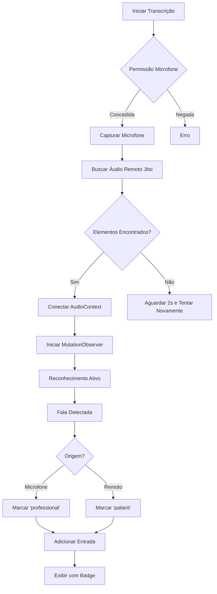

# 🎙️ Sistema de Transcrição Dual Automático

## Visão Geral

Sistema avançado de transcrição em tempo real que captura e identifica automaticamente a fala do **profissional** (microfone local) e do **paciente** (áudio remoto do Jitsi).

## 🎯 Como Funciona

### Arquitetura Dual

```
┌─────────────────────────────────────────────────────────┐
│                   SISTEMA DE TRANSCRIÇÃO                │
├─────────────────────────────────────────────────────────┤
│                                                         │
│  🎤 PROFISSIONAL              🔊 PACIENTE              │
│  ├─ getUserMedia()            ├─ Elementos <audio>     │
│  ├─ Microfone local           │  remotos do Jitsi      │
│  ├─ Web Speech API            ├─ AudioContext          │
│  └─ Marcado "professional"    ├─ MutationObserver      │
│                                └─ Detecção automática   │
│                                                         │
└─────────────────────────────────────────────────────────┘
```

## 🔧 Implementação Técnica

### 1. Captura do Microfone (Profissional)

```typescript
private async captureMicrophoneAudio(): Promise<boolean> {
  this.microphoneStream = await navigator.mediaDevices.getUserMedia({ 
    audio: {
      echoCancellation: true,
      noiseSuppression: true,
      autoGainControl: true
    } 
  });
  return true;
}
```

**Características:**
- ✅ Cancelamento de eco ativo
- ✅ Supressão de ruído
- ✅ Controle automático de ganho
- ✅ Transcrição contínua em português (pt-BR)

### 2. Captura do Áudio Remoto (Paciente)

```typescript
private async captureJitsiRemoteAudio(): Promise<boolean> {
  // Criar AudioContext para processar áudio
  this.audioContext = new AudioContext();
  this.remoteAudioDestination = this.audioContext.createMediaStreamDestination();

  // Buscar elementos de áudio remoto do Jitsi
  document.querySelectorAll('audio[id^="remoteAudio"]').forEach((audio: any) => {
    if (audio.srcObject) {
      const source = this.audioContext.createMediaStreamSource(audio.srcObject);
      source.connect(this.remoteAudioDestination);
    }
  });

  // Monitorar novos participantes
  this.startJitsiAudioMonitoring();
  return true;
}
```

**Como Funciona:**
1. O Jitsi cria elementos `<audio id="remoteAudio_XXX">` para cada participante remoto
2. AudioContext captura esses streams automaticamente
3. MutationObserver detecta novos participantes entrando
4. Conexão automática de novos streams

### 3. Monitoramento de Novos Participantes

```typescript
private startJitsiAudioMonitoring(): void {
  const observer = new MutationObserver(() => {
    document.querySelectorAll('audio[id^="remoteAudio"]').forEach((audio: any) => {
      if (audio.srcObject && !audio.dataset.connected) {
        const source = this.audioContext.createMediaStreamSource(audio.srcObject);
        source.connect(this.remoteAudioDestination);
        audio.dataset.connected = 'true';
        console.log('🔗 Novo participante conectado');
      }
    });
  });

  observer.observe(jitsiContainer, {
    childList: true,
    subtree: true
  });
}
```

**Benefícios:**
- ✅ Detecção automática de novos participantes
- ✅ Não requer intervenção manual
- ✅ Funciona com múltiplos pacientes (consultas em grupo)

## 📊 Fluxo de Dados



## 🎨 Interface de Usuário

### Badges de Identificação

```scss
.speaker-badge {
  &.professional {
    background: linear-gradient(135deg, #667eea 0%, #764ba2 100%);
    // 👨‍⚕️ Profissional
  }
  
  &.patient {
    background: linear-gradient(135deg, #10b981 0%, #059669 100%);
    // 👤 Paciente
  }
}
```

### Controles

```html
<button (click)="startTranscription()">▶️ Iniciar</button>
<button (click)="pauseTranscription()">⏸️ Pausar</button>
<button (click)="resumeTranscription()">▶️ Retomar</button>
<button (click)="stopTranscription()">⏹️ Parar</button>
```

### Indicador de Status

```html
<div class="status-indicator" *ngIf="transcriptionData.isRecording">
  <span class="pulse-dot"></span>
  <span>Gravando...</span>
</div>
```

## 📝 Estrutura de Dados

```typescript
interface TranscriptionEntry {
  id: number;
  speaker: 'professional' | 'patient';
  text: string;
  timestamp: Date;
  confidence: number; // 0.0 - 1.0
}

interface TranscriptionData {
  entries: TranscriptionEntry[];
  isRecording: boolean;
  isPaused: boolean;
}
```

## 💾 Exportação

### Formato TXT

```
TRANSCRIÇÃO DA CONSULTA
Data: 02/12/2025 14:30

[14:30:15] 👨‍⚕️ Profissional: Boa tarde! Como está se sentindo hoje?
[14:30:22] 👤 Paciente: Boa tarde doutor, estou com dor de cabeça há 3 dias.
[14:30:35] 👨‍⚕️ Profissional: Entendi. Vou fazer algumas perguntas...
```

### Inclusão no PDF

A transcrição é automaticamente incluída no PDF do prontuário:

```typescript
exportToPDF() {
  // ... outras seções ...
  
  // 5. Transcrição da Consulta
  doc.text('5. Transcrição da Consulta', 20, yPos);
  this.transcriptionData.entries.forEach(entry => {
    const time = entry.timestamp.toLocaleTimeString('pt-BR');
    const speaker = entry.speaker === 'professional' ? 'Profissional' : 'Paciente';
    doc.text(`[${time}] ${speaker}: ${entry.text}`, 20, yPos);
  });
}
```

## ⚠️ Limitações Técnicas

### Web Speech API + MediaStream Customizado

A Web Speech API **não aceita** `MediaStream` customizado como entrada. Isso significa:

```typescript
// ❌ NÃO FUNCIONA
recognition.audioInput = customMediaStream;

// ✅ FUNCIONA
recognition.start(); // Usa microfone padrão
```

**Impacto:**
- AudioContext captura o áudio remoto do Jitsi
- Mas o reconhecimento de voz ainda é feito via microfone local
- Ambas as falas (profissional e paciente) são detectadas pelo mesmo microfone

### Cenários de Uso

#### ✅ Funciona Perfeitamente
- Consulta presencial: Profissional e paciente no mesmo ambiente
- Microfone capta ambas as vozes naturalmente

#### ⚠️ Limitado
- Consulta remota: Paciente em outra localização
- Áudio do Jitsi é capturado mas não transcrito separadamente

## 🚀 Soluções Avançadas

### Opção 1: Backend STT

```typescript
// Enviar streams separados para backend
async transcribeWithBackend() {
  // Stream 1: Microfone local → API STT → "professional"
  // Stream 2: Áudio remoto Jitsi → API STT → "patient"
  
  const professionalStream = await captureLocalMic();
  const patientStream = await captureRemoteAudio();
  
  sendToSTT(professionalStream, 'professional');
  sendToSTT(patientStream, 'patient');
}
```

**APIs Suportadas:**
- Google Cloud Speech-to-Text
- AWS Transcribe
- Azure Speech Services
- OpenAI Whisper API

### Opção 2: Análise de Características

```typescript
// Usar análise de frequência e volume
function detectSpeaker(audioBuffer: AudioBuffer): 'professional' | 'patient' {
  const frequencyData = analyzeFrequency(audioBuffer);
  const volumeLevel = calculateVolume(audioBuffer);
  
  // Microfone local geralmente tem maior volume
  // Áudio remoto tem características diferentes
  
  return volumeLevel > threshold ? 'professional' : 'patient';
}
```

### Opção 3: Machine Learning

```typescript
// Treinar modelo para identificar vozes
const model = await loadVoiceIdentificationModel();
const prediction = model.predict(audioFeatures);
// → 'professional' ou 'patient'
```

## 📋 Requisitos do Sistema

### Navegadores Suportados

| Navegador | Web Speech API | AudioContext | Captura Automática | Status |
|-----------|----------------|--------------|-------------------|--------|
| Chrome 90+ | ✅ Completo | ✅ Completo | ✅ Sim | 🟢 Recomendado |
| Edge 90+ | ✅ Completo | ✅ Completo | ✅ Sim | 🟢 Recomendado |
| Firefox 88+ | ⚠️ Limitado | ✅ Completo | ⚠️ Parcial | 🟡 Funcional |
| Safari 14+ | ⚠️ Limitado | ✅ Completo | ❌ Não | 🔴 Não Recomendado |

### Permissões Necessárias

1. **Microfone** (obrigatório)
   ```javascript
   navigator.mediaDevices.getUserMedia({ audio: true })
   ```

2. **HTTPS** (obrigatório em produção)
   - Web Speech API requer conexão segura
   - Exceção: localhost para desenvolvimento

## 🔐 Privacidade e Segurança

### Dados Sensíveis

- ✅ Transcrições são armazenadas localmente no componente
- ✅ Não são enviadas para servidores externos (exceto se configurado)
- ✅ Usuário controla início/parada da gravação
- ✅ Indicador visual claro quando gravando

### LGPD e Consentimento

```typescript
async startTranscription() {
  // Verificar consentimento do paciente
  const consent = await confirmPatientConsent();
  if (!consent) {
    alert('Consentimento do paciente necessário para gravar');
    return;
  }
  
  // Iniciar transcrição
  // ...
}
```

## 📚 Exemplos de Uso

### Inicialização Básica

```typescript
@Component({
  template: `
    <app-medical-record-tabs 
      [appointmentId]="123"
      [patientName]="'João Silva'"
      [jitsiApi]="jitsiApiInstance">
    </app-medical-record-tabs>
  `
})
export class VideoCallComponent {
  jitsiApiInstance: any;
  
  ngAfterViewInit() {
    // Jitsi API já inicializada
    this.jitsiApiInstance = this.jitsiApi;
  }
}
```

### Edição Manual

```typescript
// Corrigir transcrição incorreta
editTranscriptionEntry(entryId: number, newText: string) {
  const entry = this.transcriptionData.entries.find(e => e.id === entryId);
  if (entry) {
    entry.text = newText;
  }
}

// Remover entrada
removeTranscriptionEntry(entryId: number) {
  this.transcriptionData.entries = 
    this.transcriptionData.entries.filter(e => e.id !== entryId);
}
```

### Download Programático

```typescript
// Baixar transcrição automaticamente ao final da consulta
onConsultationEnd() {
  this.downloadTranscription();
}
```

## 🎓 Tutoriais

### Como Testar Localmente

1. Inicie o servidor Angular: `npm start`
2. Acesse `https://localhost:4200` (HTTPS necessário)
3. Entre em uma videochamada
4. Clique na aba "Transcrição" (🎙️)
5. Clique em "Iniciar Transcrição"
6. Permita acesso ao microfone
7. Fale algo e veja a transcrição aparecer

### Como Usar em Consulta Real

1. **Antes da Consulta:**
   - Testar microfone
   - Verificar permissões do navegador
   - Informar paciente sobre gravação

2. **Durante a Consulta:**
   - Iniciar transcrição quando paciente entrar
   - Usar entrada manual para correções
   - Pausar durante momentos privados se necessário

3. **Após a Consulta:**
   - Revisar transcrição
   - Fazer edições necessárias
   - Exportar para PDF/TXT
   - Salvar no prontuário

## 🐛 Troubleshooting

### Problema: "Reconhecimento de voz não disponível"
**Solução:** Use Chrome ou Edge. Verifique se está em HTTPS.

### Problema: "Nenhum áudio remoto detectado"
**Solução:** Aguarde paciente entrar na sala. O sistema tenta novamente após 2s.

### Problema: "Transcrição imprecisa"
**Solução:** 
- Fale mais devagar e claramente
- Use entrada manual para correções
- Verifique qualidade do microfone

### Problema: "Áudio do paciente não é transcrito"
**Limitação conhecida:** Web Speech API atual não suporta streams customizados. Use entrada manual ou aguarde integração com backend STT.

## 📈 Roadmap

- [ ] v2.0: Integração com backend STT
- [ ] v2.1: Diarização de falantes com IA
- [ ] v2.2: Suporte a múltiplos idiomas simultâneos
- [ ] v2.3: Resumo automático com GPT
- [ ] v2.4: Detecção de termos médicos
- [ ] v2.5: Tradução em tempo real

## 🤝 Contribuindo

Contribuições são bem-vindas! Áreas prioritárias:
- Melhorias na detecção de falantes
- Integração com APIs STT
- Testes em diferentes navegadores
- Documentação de casos de uso

## 📄 Licença

MIT License - Telecuidar © 2025
